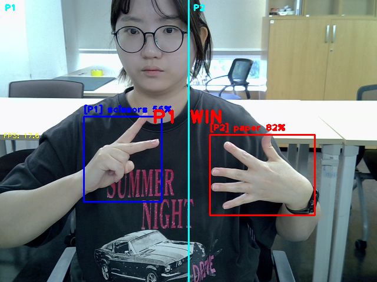
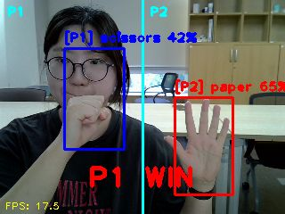
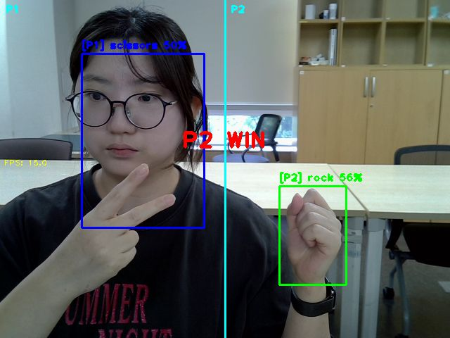
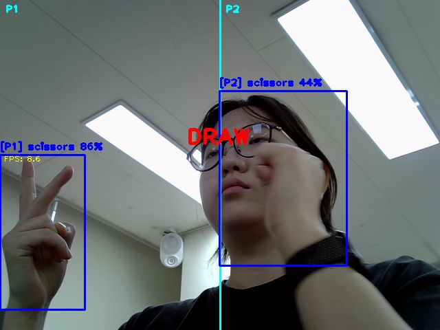

# 과제1 · YOLO 기반 온디바이스 2인 가위바위보 판정 시스템

Raspberry Pi와 LiteRT(W8A32)로 두 플레이어의 손 모양을 실시간으로 인식하고, 승부를 자동으로 판정하는 비전 게임입니다.



## 한눈에 보기
- **주제:** 수업에서 학습·경량화한 YOLO 모델을 엣지 보드에 올려 실제 서비스로 동작시키기
- **핵심:** 모델 출력(박스·클래스)을 게임 규칙과 연결하는 응용 로직
- **결과:** 기획한 기능 5단계 모두 구현 (5/5), 보드 실측 약 **9~18 FPS**

## 개발 환경
| 구분 | 내용 |
|---|---|
| 하드웨어 | Raspberry Pi, USB 카메라 |
| 모델 | YOLO → LiteRT (W8A32 양자화) |
| 언어·라이브러리 | Python, NumPy, OpenCV, simpleaudio |

## 구현 기능
1. 좌/우 플레이어 구분 (카메라 1대로 2인 동시 인식)
2. 가위바위보 승패 판정
3. 예외 처리 (손 미검출 등)
4. 3-2-1 카운트다운 타이밍 제어
5. 게임성 확장: 점수판, 효과음, 판정 이미지·CSV 로그 자동 저장, 화면 배율 조절

## 모델 선정: 왜 W8A32인가
FP32 기본 모델, INT8, W8A32 세 가지를 비교했습니다.
- **INT8:** 가장 빠르지만(29.3ms) 정확도 보존율 93%
- **W8A32 (적용):** 용량 2.79MB(48% 감소), mAP50-95 정확도 **96% 보존**
- 게임 판정은 오인식이 치명적이라 **정확도 보존이 높은 W8A32를 선택**했습니다.

## 실행 결과
판정 순간마다 이미지와 로그가 자동 저장됩니다. → [`results_log.csv`](results_log.csv), [`captures/`](captures)

| P1 WIN | P2 WIN | DRAW |
|---|---|---|
|  |  |  |

## 파일 구성
```
assignment1-rps-yolo/
├── README.md
├── rps_yolo_game.py   # 게임 메인 코드
├── results_log.csv    # 판정 기록 로그
├── report.pdf         # 결과보고서 (모델 비교·오류 분석·향후 과제 포함)
└── captures/          # 판정 순간 캡처 이미지
```

## 실행 방법
```bash
pip install ai-edge-litert opencv-python numpy simpleaudio
python rps_yolo_game.py
```
> 모델 파일(`best_w8a32.tflite`)은 저장소에 포함되어 있지 않습니다. 같은 폴더에 두고 실행하세요.

📄 자세한 내용은 [결과보고서](report.pdf)를 참고하세요.
